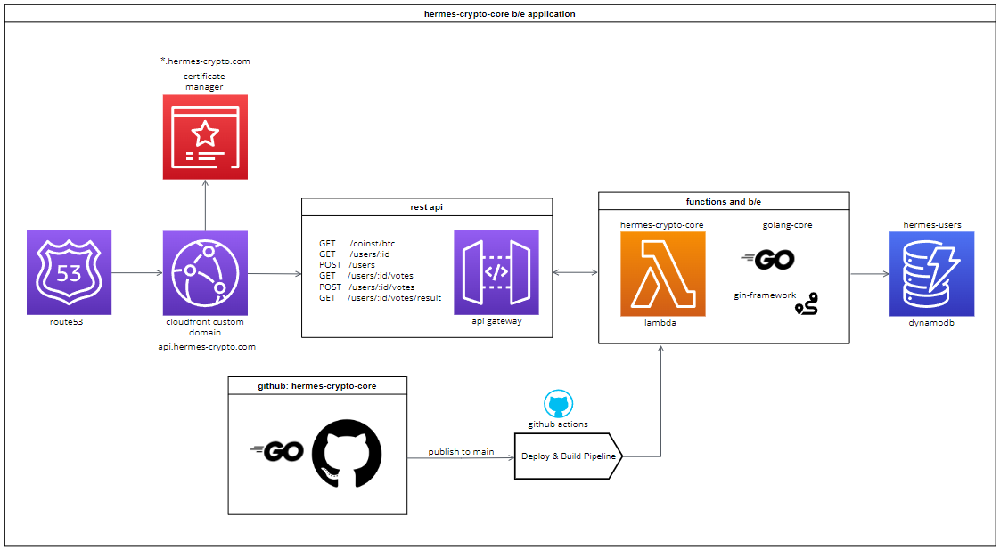

<h1 align="center"> hermes-crypto-core</h1>
<p align="center"></p>

Hermes (called Mercury in Roman mythology) was considered the messenger of the Olympic gods. He possesses the ability to influence outcomes and tip the scales in favor of those who seek his benevolence. As the god of luck, he brings both fortune and misfortune to those who dare to ask.

`hermes-crypto` is a fun page where you can ponder if the price of your coin will go up or down; place your bets, and see if the gods will be in your favour!

## This REPO
This repo contains all the services and core code (and none of the client stuff!). That means business logic, APIs and other goodies that you would normally associate with a B/E.

## Status

[](https://github.com/svbygoibear/hermes-crypto-core/actions/workflows/deploy-to-lambda.yaml)  [](https://github.com/svbygoibear/hermes-crypto-core/actions/workflows/run-tests-on-pr.yaml)  [](https://github.com/svbygoibear/hermes-crypto-core/releases)

## Project Structure

```bash
.
├── README.md                   <-- This instructions file
├── deployments                 <-- This contains files to help setup the environment and database locally.
├── internal                    <-- All internal services, routing, middleware, dbs etc
│   ├── db                      <-- All logic relating to interacting with the underlying database
│   └── handlers                <-- These are our API handlers - they are the glue that keeps things together
│   └── middleware              <-- Middleware for our API > in this case error handling
│   └── models                  <-- All models used throughout this app
│   └── coin                    <-- External services code to interact with Gecko Coin
└── main.go                     <-- Lambda function code, our entrypoint
```

### API
This is an API with all the functionality necessary to run. It follows some `REST`-like principles, and the API itself is split into domains:

#### Users
The `users` API focusses on all functions relating to users and their votes. Since user and vote entities are tied together, they are both represented by this API together.

#### Coins
The `coins` API is centered around... You guessed it! Coin prices. This gives us the ability to swap out our 3rd party APIs easily by exposing a set of our own endpoints to our F/E client.

## What makes me tick?

Under the hood, I am powered by;

-   [Gin](https://gin-gonic.com/): Gin is a fast, easy to use web-framework perfect for crafting APIs at scale!
-   [Golang](https://go.dev/): Go is an open-source programming language that is easy to learn, has tons of libraries and is well used and loved.
-   [DynamoDB](https://aws.amazon.com/pm/dynamodb): Following the theme of easy and lightweight, this project makes use of  DynamoDB to keep track of votes and user information.

# Installation

### Software

To properly run this project, assuming you already have git installed, you will also need to ensure that you have the following installed on your machine:

-  AWS CLI already configured with Administrator permission
-   [Go](https://go.dev/doc/install): First things first, click on the link to install the latest version of Go. This project has been tested with `v1.22.6` and offers support for this version. Follow the requirements based on your OS.
-   [node.js](https://nodejs.org/en): Lowest possible version compatible with this project is `v18.14.0`. The current LTS is however recommended.
-   [AWS CLI](https://docs.aws.amazon.com/cli/latest/userguide/getting-started-install.html): Interacting with any CLI commands will require the installation of AWS CLI.
-   [AWS SAM CLI](https://docs.aws.amazon.com/serverless-application-model/latest/developerguide/install-sam-cli.html): We will be using the AWS SAM CLI for deploying code. This is also to run our lambda API locally for testing. Currently this has been tested on version `1.121.0`.
-   [Git](https://git-scm.com/book/en/v2/Getting-Started-Installing-Git): You will also need to install Git (hopefully you have already - but if not now is your chance!).
-   [Docker](https://www.docker.com/): To make things easier, this project has been dockerized. No more manual db setup, just compose and GO. 
-   [NoSQL Workbench](https://docs.aws.amazon.com/amazondynamodb/latest/developerguide/workbench.html): If you want to connect to your local instance of DynamoDB - use AWS' NoSQL Workbench. For more info on connecting to a local db; check [this](https://medium.com/@bthiban/running-dynamodb-locally-using-docker-68c8bbed29fa) out.
-   [AWS Lambda runtime interface emulator](https://docs.aws.amazon.com/lambda/latest/dg/go-image.html#go-image-provided): If you want to attempt to run and debug the underlying serverless Lambda architecture, you will need to install the emulator. More info [here](https://github.com/aws/aws-lambda-runtime-interface-emulator?tab=readme-ov-file#installing) as well. Take note of your operating system.
-   [Make](https://makefiletutorial.com/): Another way to interact with this repo is to make use of... Make! It is still useful, even if this is not a large program.


#### Extra info
- For multiple versions of Go, have a look here: [Managing Go Installations](https://go.dev/doc/manage-install).

#### Running and Deploying
There are a few extra steps before getting this project up and running, so follow these steps to do so seamlessly. I assume that you already know how to use Go and how to use AWS. Refer to any of the links above to help get started if that is not the case.

##### CoinGecko
To fetch crypto related data, we are currently connected to [`CoinGecko`](https://www.coingecko.com/). You will need to create a free account when testing this locally and replace the `GECKO_API_KEY` environment variable with the API Key from your account.

##### Run locally
First you will need to setup a `.env` file on project root with the following structure, adding your own values where needed:
```
# .env file
# This is all your config
IS_LOCAL=true

GECKO_API_KEY=[your-key-here]

AWS_DYNAMODB_REGION=[your-region-here]
```
Keep in mind this will not be committed as part of your code.

#### Setup Environment
This is where the `Makefile` will come in handy. Depending on if you are on a windows machine (or not - note windows functionality is the only one that has been tested); you can run;
```
make build-windows
```
This will build (and zip) this project as well as kick off a local dynamodb database for you to work with as you develop. Some info on this:
- The zip file can directly be uploaded to [AWS Lambda](https://aws.amazon.com/pm/lambda), with a function configured as a REST API with all your environment variables and roles setup to deploy this manually.
- It also creates your database, which you can connect on your database GUI using `localhost` and port `1433`.

##### CAVEAT
Check out the [Coming Improvements](./docs/improvements.md) document below, currently there is no "seamless" way to run this project and connect it to dynamoDB in one quick command. Therefore for every bit of code and logic added, there also need to be corresponding tests to ensure code quality.

## Architecture
This whole application has been built to run serverless on AWS Lambda. This diagram gives you a rough idea of what that looks like:

This project is fueled by `gin` and `Go` to keep things going, all whilst currently exposing 2 main domains

## A Deep Dive
This `README.md` is only the entry point to getting started with this project but it does not give you the full insight into some of the decisions made *nor* about any upcoming work that has been prioritised. If you want to dive into that info, please check out:

-   [Coming Improvements](./docs/improvements.md): This project may "work" but it can always be improved! Have a look at upcoming enhancements and improvements.
-   [Technical Decisions](./docs/choices.md): This is a "demo" project, thus some decisions were made which is different to when you host a full `prod` application. This is as close as can be in limited time, but this document explains some of those differences.

### Corresponding F/E
This project has a corresponding F/E application. Go here to check it out:
[](https://github.com/svbygoibear/hermes-crypto)

## Contributing

Pull requests are welcome. For major changes, please open an issue first to discuss what you would like to change.
We follow the following structure when it comes to adding labels or PRs:
- New work: This is either a `enhancement` or `feature` as it adds essentially "new code" or "updates code" related to the functionality of this app.
- Docs: If you are updating the documentation, adding any helpers or tests this would fall under `chore` or `documentation`.
- Dependencies: Specifically for updating of dependencies, please use `dependencies` as the label. This should contain no other types of work.
- Bugs: Resolving issues or bugs, use `fix`, `bugfix` or `bug`. If you have to update dependencies to resolve a bug, then tag it as a bug and not a dependency.

## License

[MIT](https://choosealicense.com/licenses/mit/)